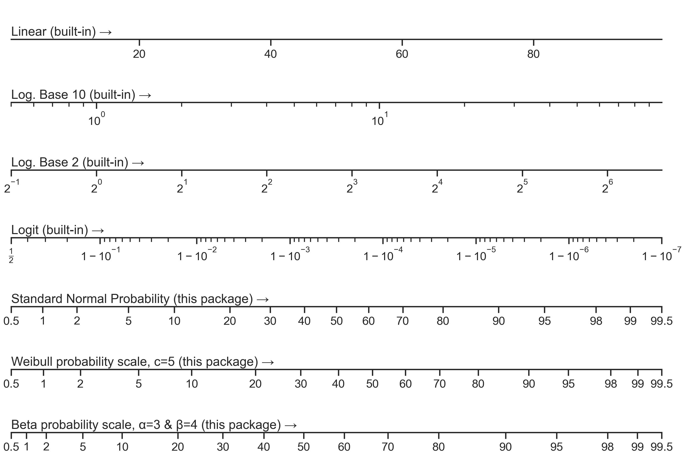

# mpl-probscale
Real probability scales for matplotlib

[](https://travis-ci.org/phobson/mpl-probscale)
[](https://codecov.io/gh/phobson/mpl-probscale)


[Sphinx Docs](http://phobson.github.io/mpl-probscale/)

## Installation

### Official releases

Official releases are available through the conda-forge channel or pip"
`conda install mpl-probscale --channel=conda-forge`

`pip install probscale`

### Development builds

Development builds are available through my conda channel:

`conda install mpl-probscale --channel=phobson`


## Quick start

Simply importing `probscale` lets you use probability scales in your matplotlib figures:

```python
import matplotlib.pyplot as plt
import probscale
import seaborn
clear_bkgd = {'axes.facecolor':'none', 'figure.facecolor':'none'}
seaborn.set(style='ticks', context='notebook', rc=clear_bkgd)

fig, ax = plt.subplots(figsize=(8, 4))
ax.set_ylim(1e-2, 1e2)
ax.set_yscale('log')

ax.set_xlim(0.5, 99.5)
ax.set_xscale('prob')
seaborn.despine(fig=fig)
```



## Testing

Testing is generally done via the ``pytest`` and ``numpy.testing`` modules.
The best way to run the tests is in an interactive python session:

```python
import matplotlib
matplotib.use('agg')
import probscale
probscale.test()
```
