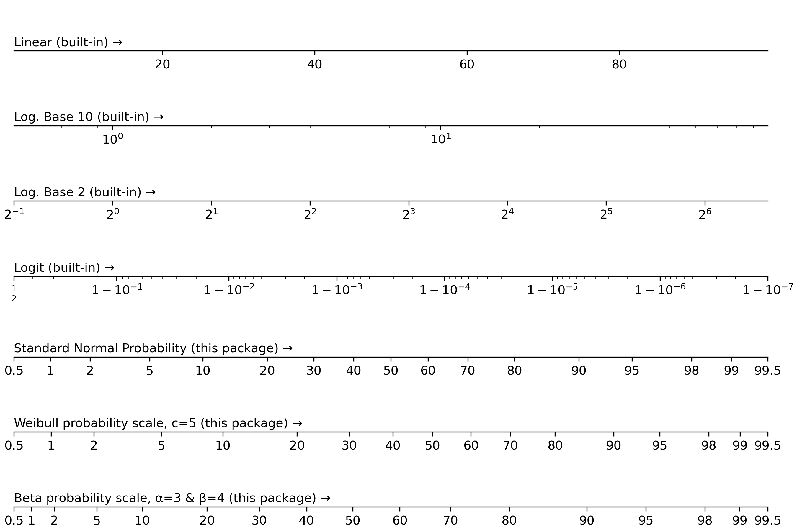

# mpl-probscale

Real probability scales for matplotlib


[Sphinx Docs](http://matplotlib.org/mpl-probscale/)

## Installation

### Official releases

Official releases are available through the conda-forge channel or pip

`conda install mpl-probscale --channel=conda-forge`

`pip install probscale`

### Development builds

This is a pure-python package, so building from source is easy on all platforms:

```shell
git clone git@github.com:matplotlib/mpl-probscale.git
cd mpl-probscale
pip install -e .
```

### Additional Depedencies

This library depends on **pytest** framework.
The current release version does not have it listed as a hard dependency, however.
So for now you will need to install ``pytest`` yourself to use mpl-probscale:

`pip install pytest`

or

`conda install pytest --channel=conda-forge`

In the next release, this depedency will be made optional.

## Quick start

Simply importing `probscale` lets you use probability scales in your matplotlib figures:

```python
import matplotlib.pyplot as plt
import probscale
import seaborn
clear_bkgd = {'axes.facecolor':'none', 'figure.facecolor':'none'}
seaborn.set(style='ticks', context='notebook', rc=clear_bkgd)

fig, ax = plt.subplots(figsize=(8, 4))
ax.set_ylim(1e-2, 1e2)
ax.set_yscale('log')

ax.set_xlim(0.5, 99.5)
ax.set_xscale('prob')
seaborn.despine(fig=fig)
```



## Testing

Testing is generally done via the ``pytest`` and ``numpy.testing`` modules.
The best way to run the tests is in an interactive python session:

```python
import matplotlib
matplotlib.use('agg')
from probscale import tests
tests.test()
```
